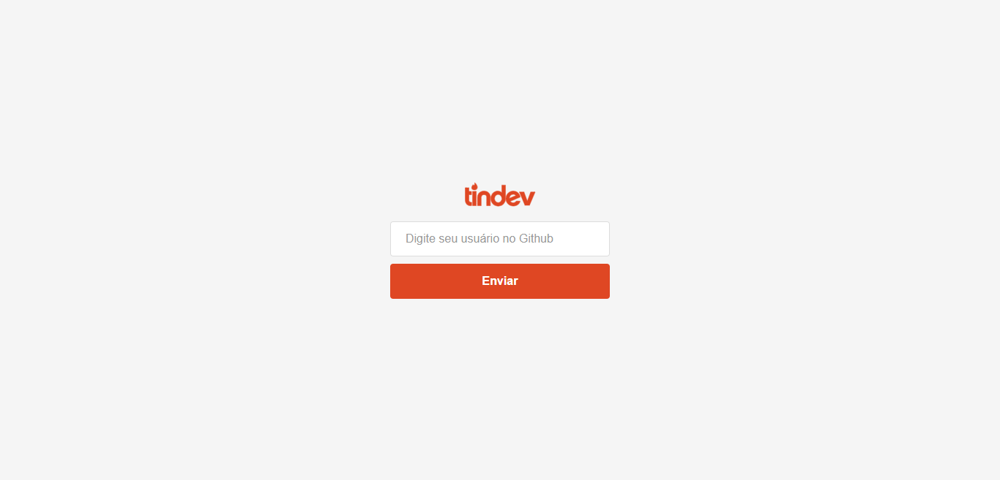
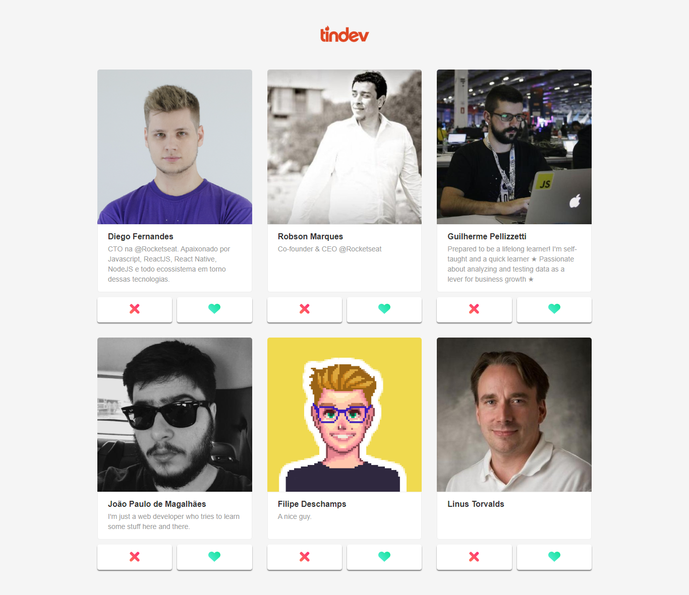
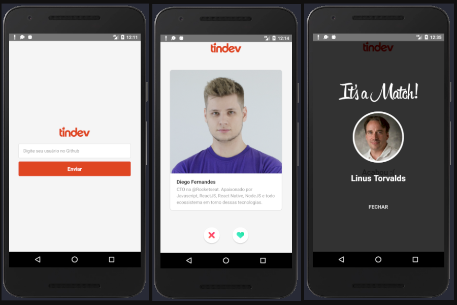

# tindev - "tinder" for devs

Omnistack 08

## Frontend






## Mobile



## Steps to Setup

1. Clone this repository

```bash
git clone https://github.com/MarioCesarJr/tindev.git
```

2. Connect application with MongoDB Atlas

```bash
cd backend
```

Open `src/server.js` file and edit:

```
mongoose.connect(
  'mongodb+srv://<username>:<password>@cluster0-xyulq.mongodb.net/omnistack8?retryWrites=true&w=majority',
  {
    useNewUrlParser: true
  }
);
```

3. Install dependencies

```bash
> yarn
```

4. Run api

```bash
> yarn dev
```

## Frontend

1. Install dependencies

```bash
> cd frontend
```

```bash
> yarn
```

2. Run App

```bash
> yarn start
```

Open <http://localhost:3000> to view it in the browser.

## Mobile

1. Install dependencies

```bash
> cd mobile
```

```bash
> yarn
```

2. Run app

```bash
  # android
> react-native run-android

  # ios:
> react-native run-ios
```